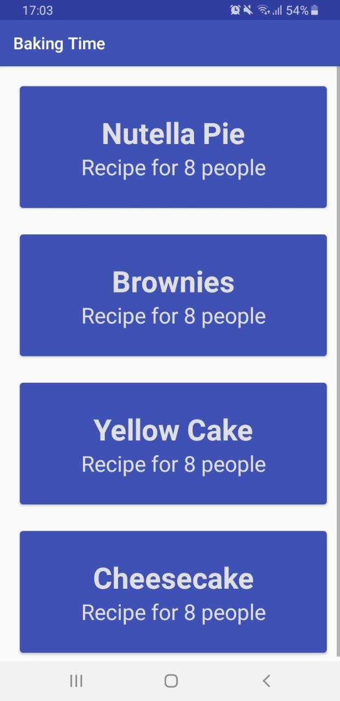
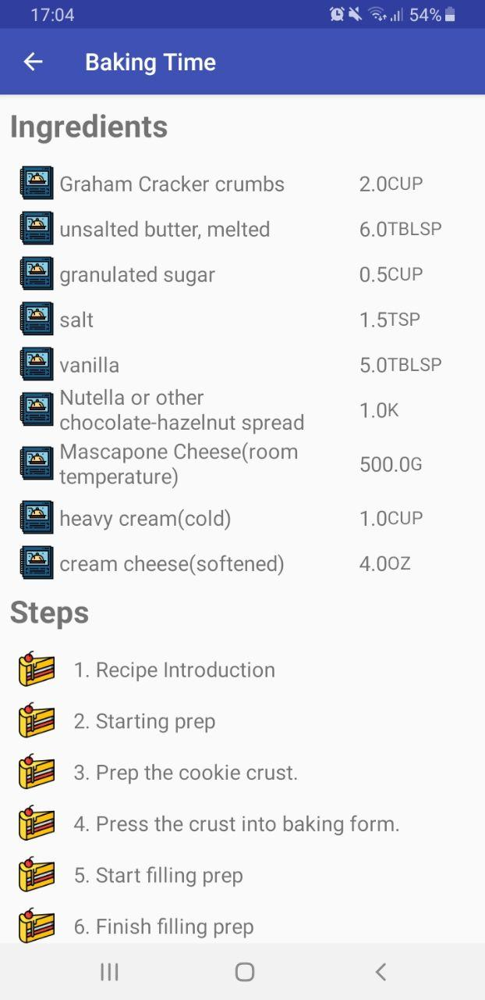
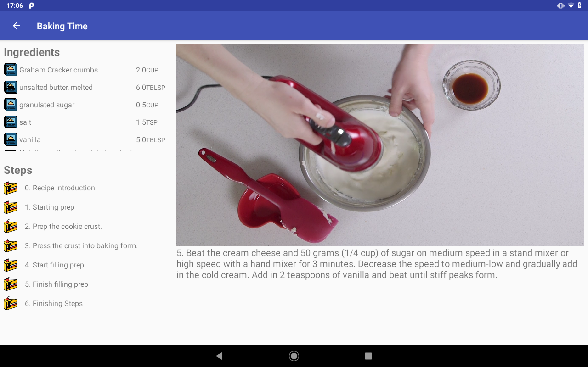

# Baking time!

This repo contains all the work done for the **Baking App** project of the Udacity's Android Developer Nanodegree.

## Application description

This app shows different cake recipes and the steps and ingredients needed for baking them.

The user is able to navigate the app selecting the desired recipe and its different steps to obtain the information needed in order to bake this delicious cakes!

### Application details

The first time the application is launched, it obtains the recipe information from the internet and store it in a database. See [Database schema section](https://github.com/acasadoquijada/baking_time#database-schema) for more info about this

The application has three Activities:

* MainActivity
* DetailRecipeActivity
* StepDetailAcivty

The flow between them is the following:

In MainActivity the recipe's name and serving is presented to the user using a Fragment (RecipeListFragment).

Once the user clicks in a recipe. a DetailRecipeActivity is opened. Here the recipe's ingredients and steps are shown using two fragments (IngredientListFragment and StepListFragments)

The user is able to click in one of the steps to launch a StepDetailActivity containing a video illustrating how to perform the step (VideoFramgent) and a more detail description about it (StepDetailFragment). The user is able to navigate between the steps with a previous and next button. In larger devices such as tablets, the step video and description will be shown as well.

### Database schema

For storing the recipe data in a database Room has been used. For more details about database structure please see the [recipe module](https://github.com/acasadoquijada/baking_time/tree/master/app/src/main/java/com/example/backing_app/recipe) and for more information about the database implementation see the [database module](https://github.com/acasadoquijada/baking_time/tree/master/app/src/main/java/com/example/backing_app/database) 

The database used contains three tables:

| Recipe          | Ingredient                  | Step                        |
|-----------------|-----------------------------|-----------------------------|
| int id //@key   | int key //@key              | int key //@key autogenerate |
| String name     | float quantity              | int id                      |
| String servings | String measure              | String shortDescription     |
| String name     | String ingredientName       | String description          |
| -               | int recipeId //@Foreign key | String videoURL             |
| -               | - | int recipeId //@Foreign key |

The recipe table doesn't contain any information related to the ingredients or steps. On the other hand, those tables contains a index of their recipe as foreign key.

###Screenshots

Please see [here](https://github.com/acasadoquijada/baking_time/doc/images)  the full screenshot set

  

### Relevant libraries used

- [Moshi](https://github.com/square/moshi) for parsing the recipes from JSON

- [ExoPlayer](https://github.com/google/ExoPlayer) for reproducing the step videos

### External resources

The image shown where a step doesn't contain a video was obtained from [here](https://videomembertheme.szablonstrony.pl/wp-content/themes/videomembertheme/images/novideo.png) 

The logos shown in the RecipeDetailActivity are the following:

* recipe_book.png. Obtained from [flaticon](https://www.flaticon.com/)  and made by [smalllikeart](https://www.flaticon.com/authors/smalllikeart) 

* cake.png.  Obtained from [flaticon](https://www.flaticon.com/)  and made by [Creaticca Creative Agency](https://www.flaticon.com/authors/creaticca-creative-agency)
